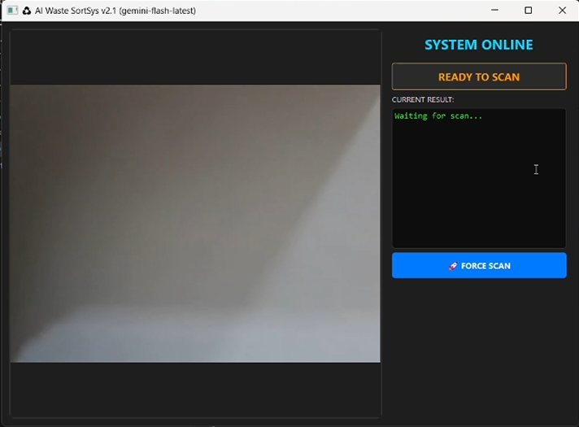

# Real-Time-Waste-Classification-Using-Computer-Vision-and-Gemini

An AI-powered smart waste classification system that combines **Computer Vision**, **Google Gemini AI**, and a **PyQt5 desktop dashboard** to automatically identify and categorize waste materials in real time.

The system captures images from a webcam, detects the presence of an object, and uses Gemini Vision to classify waste into predefined categories for smart recycling and waste management applications.

---

## 🚀 Features

### 🎥 Real-Time Object Detection
- Live webcam monitoring
- Automatic object presence detection
- Edge-based contour analysis using OpenCV

### 🤖 Gemini AI Classification
Identifies waste categories using Gemini Vision:

- Plastic
- Metal
- Glass
- Paper
- Organic
- Hazardous

### 🖥️ Industrial Dashboard
- Real-time camera feed
- Classification results panel
- System status monitoring
- Manual scan trigger

### ⚡ Smart Scanning Logic
- Automatic object detection
- Scan cooldown mechanism
- Prevents unnecessary API calls
- Background processing using threads

### 🎨 Modern User Interface
- Dark industrial theme
- Live status indicators
- Responsive layout
- Easy-to-use controls

---

## 🛠️ Technology Stack

### Programming Language
- Python 3

### Computer Vision
- OpenCV

### Artificial Intelligence
- Google Gemini Vision API

### GUI Framework
- PyQt5

### Networking
- Requests

### Image Processing
- Base64 Encoding
- Contour Detection
- Edge Detection (Canny)
- Gaussian Blur

---

## 📂 Project Structure

```text
Waste-Classification-System/
│
├── main.py
├── requirements.txt
├── temp_scan.jpg
│
├── assets/
│   ├── icons/
│   └── screenshots/
│
└── README.md
```

---

## ⚙️ System Workflow

```text
Webcam Feed
      │
      ▼
Object Detection
      │
      ▼
ROI Extraction
      │
      ▼
Image Preprocessing
      │
      ▼
Gemini Vision API
      │
      ▼
Waste Classification
      │
      ▼
Display Result
```

---

## 🔍 Detection Pipeline

### 1. Object Detection
The webcam continuously monitors the detection zone.

### 2. Contour Analysis
OpenCV extracts object boundaries using:

- Grayscale Conversion
- Gaussian Blur
- Canny Edge Detection
- Contour Extraction

### 3. ROI Extraction
The detected object is cropped and prepared for analysis.

### 4. AI Classification
The image is sent to Gemini Vision API for classification.

### 5. Result Display
The detected waste category is shown on the dashboard.

---

## 📸 Screenshots

### Main Dashboard

```markdown

```

### Waste Detection & Classification Result

```markdown

```

---

## 🎥 Demo

Add a GIF:

```markdown

```

---

## 🚀 Installation

### Clone Repository

```bash
git clone https://github.com/YOUR_USERNAME/real-time-waste-classification.git
cd real-time-waste-classification
```

### Install Dependencies

```bash
pip install -r requirements.txt
```

### Add Gemini API Key

Replace:

```python
API_KEY = "YOUR_NEW_API_KEY_HERE"
```

with your Gemini API key.

### Run Application

```bash
python main.py
```

---

## 🌍 Applications

- Smart Recycling Systems
- Automated Waste Segregation
- Smart Cities
- Industrial Waste Management
- Environmental Monitoring
- Educational Demonstrations

---

## 🔮 Future Improvements

- YOLO-based object detection
- Local AI inference
- Conveyor belt integration
- Robotic waste sorting
- Database logging
- Multi-object classification
- IoT dashboard integration

---

## 📊 Expected Output

| Waste Item | Classification |
|------------|---------------|
| Plastic Bottle | Plastic |
| Newspaper | Paper |
| Food Waste | Organic |
| Aluminum Can | Metal |
| Glass Bottle | Glass |
| Battery | Hazardous |

---

## 👨‍💻 Author

**Teicho**

B.E. Mechatronics Engineering

Interests:
- Computer Vision
- Artificial Intelligence
- Industrial Automation
- Robotics
- Smart Manufacturing

---

## 📜 License

This project is intended for educational, research, and prototype development purposes.
